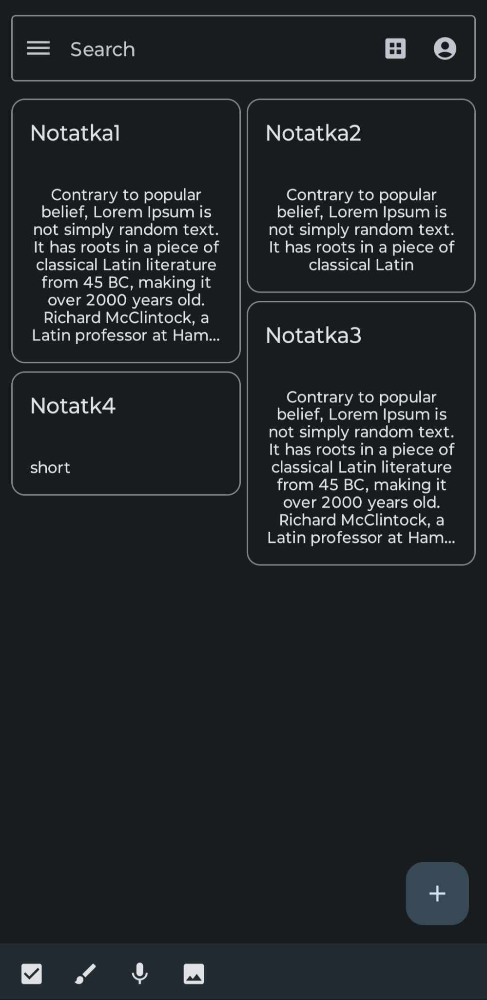

# NoteApp

This is a simple NotesApp written in Kotlin with Android Studio. It is a basic app that allows the user to add, edit and delete notes. The notes are saved in a SQLite database.
UI was created with the help of the Material Design library, Jetpack Compose and  Room library to interact with the database.
Additional functionalities including for example audio notes, images, or drawing are not implemented yet.
______________________
* Main screen of the app with a list of notes

* Adding a new note/details of the note

